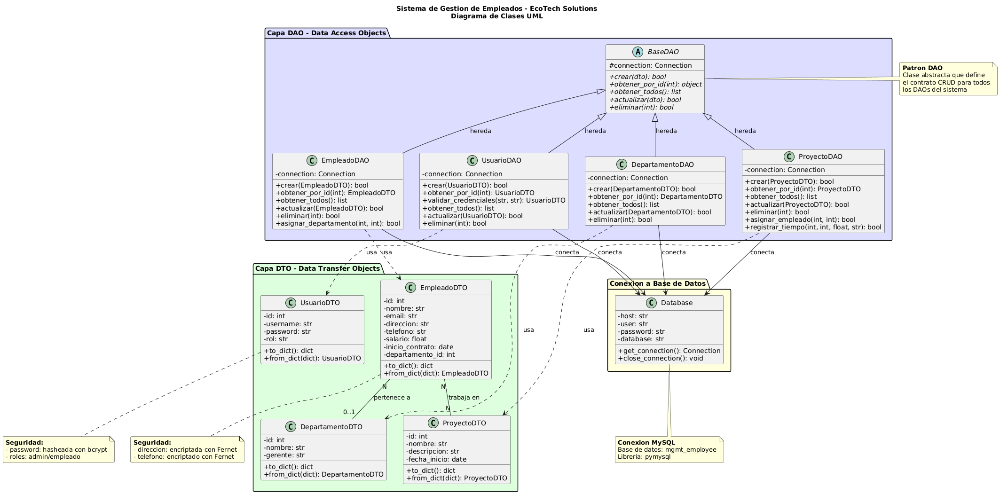

# Instrucciones — configurar y ejecutar la app

1. Crear y activar el entorno virtual (desde la carpeta `management/`):

```bash
python -m venv .venv

source .venv/Scripts/activate
```

2. Actualizar herramientas e instalar dependencias:

```bash
python -m pip install --upgrade pip setuptools wheel
pip install -r requirements.txt
```

3. Variables de entorno / configuración (opcional):

```bash
cp .env.example .env
```

4. Inicializar la base de datos (si usas la DB local/XAMPP):

```bash
python scripts/setup_database.py
```

5. Ejecutar la aplicación:

```bash
python main.py
```

6. Ejecutar script de pruebas:

```bash
python scripts/test_sistema.py
```

## Diagrama de Clases UML

<details>
<summary><strong>Ver Diagrama</strong></summary>



</details>

El diagrama muestra la arquitectura del sistema con:

- **Capa DTO**: Objetos de transferencia de datos (EmpleadoDTO, DepartamentoDTO, ProyectoDTO, UsuarioDTO)
- **Capa DAO**: Objetos de acceso a datos con herencia de BaseDAO (patron DAO)
- **Seguridad**: Encriptacion con Fernet y hash con bcrypt
- **Relaciones**: Asociaciones entre Empleado-Departamento (N:1) y Empleado-Proyecto (N:N)

## Cumplimiento de la Pauta

<details>
<summary><strong>ETAPA 1 - POO y CRUD</strong></summary>

### 2.1.1 Diagrama de Clases UML

- **Diagrama**: `docs/diagrama_clases.puml` - Diagrama completo del sistema
- **Imagen**: `docs/diagrama_clases.png` - Visualizacion en formato PNG
- **Herramienta**: PlantUML - Estandar UML con notacion correcta

### 2.1.2 Herencia, Encapsulamiento y Polimorfismo

- **Herencia**: `DAO/base_dao.py` - Clase abstracta BaseDAO heredada por todos los DAOs
- **Polimorfismo**: Metodos abstractos CRUD implementados de forma especifica en cada DAO
- **Encapsulamiento**: Separacion en capas - `DAO/` (acceso a datos), `DTO/` (transferencia), `model/` (entidades)

### 2.1.3 Librerías de Conexión a BD

- **Conexión BD**: `DAO/database.py` - Patrón Singleton usando librería `pymysql`
- **Configuración**: `config/database_config.py` - Variables de conexión y credenciales

### 2.1.4 Métodos CRUD

- **Empleados**: `DAO/empleado_dao.py` - CRUD (Create, Read, Update, Delete)
- **Departamentos**: `DAO/departamento_dao.py` - Gestión completa de departamentos
- **Proyectos**: `DAO/proyecto_dao.py` - Gestión de proyectos + registro de tiempo
- **Usuarios**: `DAO/usuario_dao.py` - Gestión de usuarios del sistema
- **Clase Base**: `DAO/base_dao.py` - Métodos CRUD reutilizables con herencia

### 2.1.5 Manejo de Excepciones

- **Bloqueos Try-Catch**: Implementados en todos los métodos DAO para capturar errores de BD
- **Validaciones**: `main.py` - Validación de entradas y manejo de errores en interfaz

</details>

<details>
<summary><strong>ETAPA 2 - Seguridad y APIs</strong></summary>

### 3.1.1 Autenticación con Hash

- **Hash de Contraseñas**: `utils/utils.py` - Funciones `hash_password()` y `check_password()` usando `bcrypt`
- **Validación Segura**: `DAO/usuario_dao.py` - Método `validar_credenciales()` con verificación de hash
- **Login**: `main.py` línea 60-90 - Sistema de autenticación con contraseña enmascarada (\*)

### Cifrado de Datos Sensibles

- **Cifrado Simétrico**: `utils/utils.py` - Funciones `encriptar_dato()` y `desencriptar_dato()` con `Fernet`
- **Datos Protegidos**: Dirección y teléfono de empleados cifrados en BD

### 3.1.2 Consumo de API Externa

- **Librería HTTP**: `utils/utils.py` - Uso de `requests` para consumo de API
- **API Externa**: `consultar_indicadores()` - Consume mindicador.cl con manejo de excepciones
- **Indicadores**: UF, IVP, IPC, UTM, Dólar Observado, Euro

### 3.1.3 Deserialización JSON

- **Procesamiento**: `utils/utils.py` - Uso de `response.json()` para deserializar respuesta de API
- **Estructura**: Parseo de datos en formato JSON y conversión a objetos Python

### 3.1.4 Almacenamiento en BD

- **Registro de Indicadores**: `main.py` línea 390-440 - Guarda datos de API en tabla `indicadores_economicos`
- **Persistencia**: Almacena nombre indicador, fecha valor, fecha consulta, usuario y sitio proveedor

### Funcionalidades Adicionales

- **Generación de Reportes**: `utils/utils.py` - Funciones `generar_excel()` y `generar_pdf()` con `openpyxl` y `reportlab`
- **Interfaz de Usuario**: `main.py` - Menús interactivos en consola con validaciones de entrada
- **Script de Pruebas**: `scripts/test_sistema.py` - Verifica todas las funcionalidades del sistema

</details>
